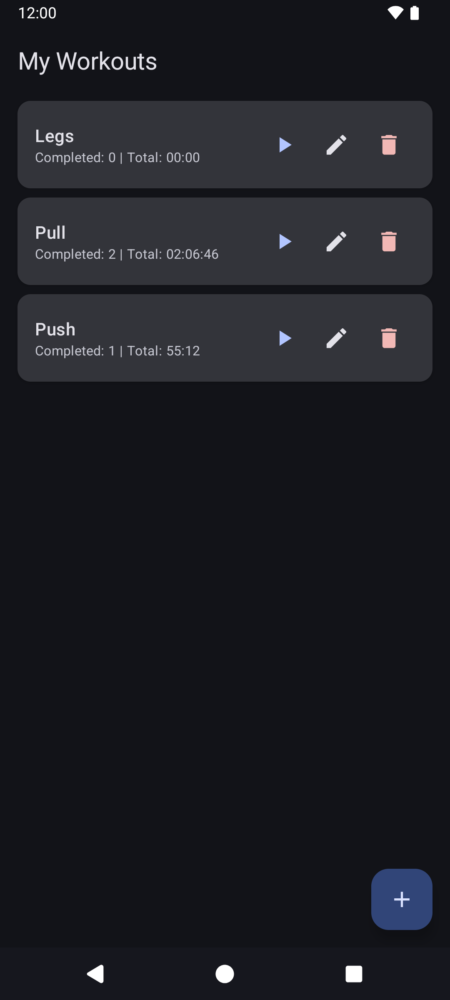
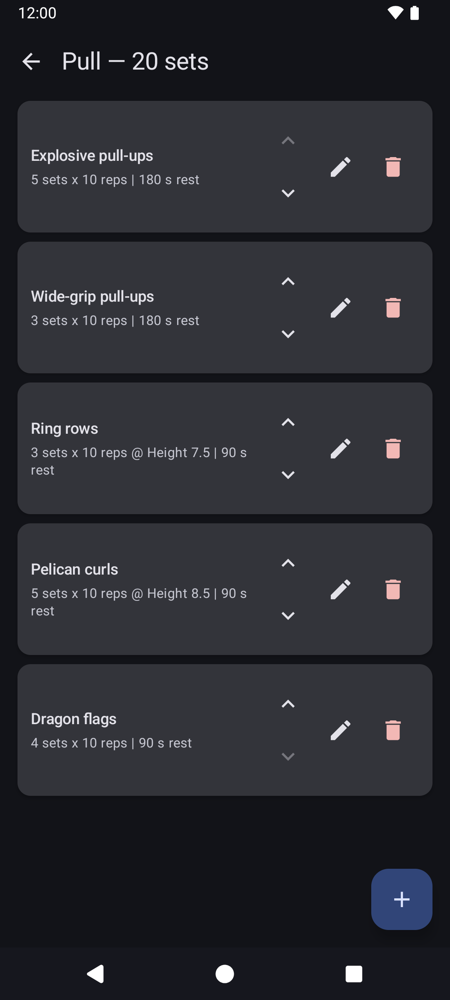
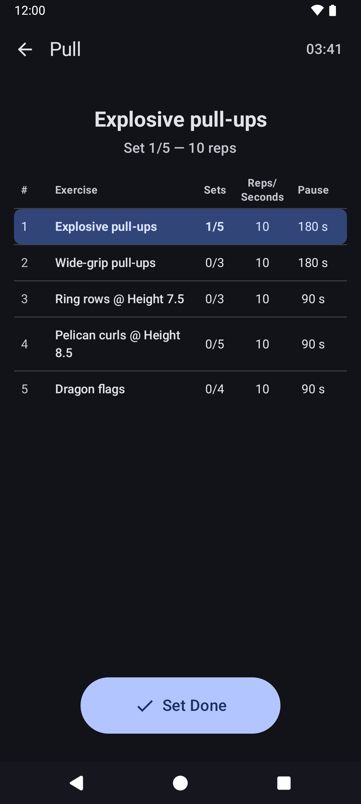
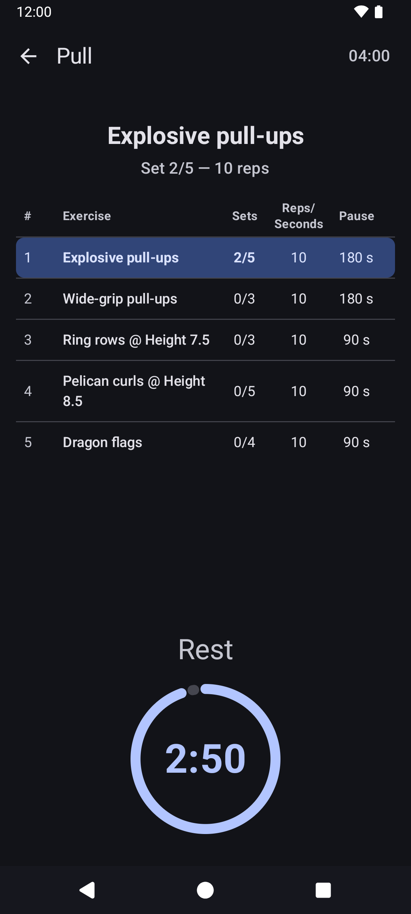

# Training Tracker

[](https://github.com/nicohinze/training-tracker/actions/workflows/ci.yml)
[](https://raw.githubusercontent.com/nicohinze/training-tracker/refs/heads/main/LICENSE)

An Android app for creating and running workouts with a set-tracking rest timer.

## Screenshots

<p align="center">
  
  
  
  
</p>

## Features

- Create, edit, rename, and delete workouts
- Add exercises to workouts with configurable sets, reps, rest duration, and intensity
- Exercise types: reps-based and time-based
- Run workouts with an interactive timer that tracks sets and rest periods
- Total run-time display for active workouts
- Screen stays on during active workouts

## Building

```bash
./gradlew assembleDebug   # Debug APK
./gradlew assembleRelease # Release APK (minified + shrunk)
```

## Testing

```bash
./gradlew testDebugUnitTest         # Unit tests
./gradlew connectedDebugAndroidTest # Instrumented tests (requires device/emulator)
```

## Architecture

Single-activity app with three screens:

| Screen         | Purpose                                                                                                         |
|----------------|-----------------------------------------------------------------------------------------------------------------|
| Workout List   | Browse and manage workouts                                                                                      |
| Workout Edit   | Add, edit, reorder, and delete exercises within a workout                                                       |
| Active Workout | Run a workout with a state machine (Ready -> Exercising <-> Resting -> Finished) and coroutine-based rest timer |

Data layer uses Room with `Flow`-based queries for reactive UI updates. No DI framework - the database singleton is accessed through the `Application` class.

## License

[MIT](LICENSE.md)
